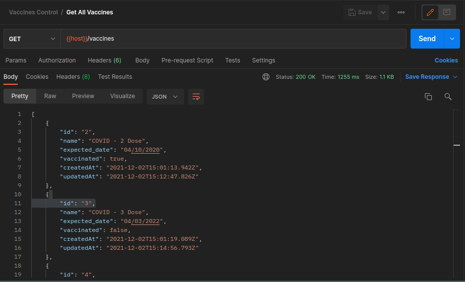

<h1 align="center"> Vaccines Control API </h1>

<h4 align="center">
	🚧   Concluded 🚀 🚧
</h4>
</br>


<br/>

### 💻 About the project
---

Project developed during the Node.js course of Women Can Code program - partnership between Share RH company and DASA company.

<br/>

### ✔️ Requirements
---

To use this project will be necessary to have install in your laptop, the following tools:
- [Git](https://git-scm.com)
- [Node.js](https://nodejs.org/en/)
- [VSCode](https://code.visualstudio.com/)
- [Postman](https://www.postman.com/)

<br/>

### 📦 🔨 How to Install
---
<br/>

```bash
# Clone this repository
$ git clone <https://github.com/bsmedina/vaccines-api.git>

# Go into the repository
$ cd vaccines-api

# Install dependencies
$ npm install

# In Postman import the collection which is in the project's root

# Run the app
$ npm start

# The server will start in port:3000 - acess <http://localhost:3000>
```

<br/>

If you prefer, you can see the deploy did in [heroku](https://herokuapp.com/).


<br/>

### 🛠️ Technologies
---
- Javascript
- [Node.js](https://nodejs.org/en/)
- [PostegreSQL](https://www.postgresql.org/)
- [Sequelize](https://sequelize.org/)
- [Heroku](https://heroku.com/)

<br/>


### ✔️ Features
---
- [x] Create vaccine
- [x] Get all vaccines
- [x] Get vaccine by id
- [x] Filter vaccine by vaccinated query
- [x] Update vaccine
- [x] Update only vaccinated field

<br/>

### 🖋️ Author
---
<br/> 

<table align="center">
    <tr>
        <td align="center"><a href="https://www.linkedin.com/in/beatriz-sampaio-medina-a59400156/"><br /><sub><b>Beatriz Medina</b></sub></a><br /><a>🚀</a></td>
    </tr>
</table>

<p align="center">Made with ❤️ by Beatriz Medina 👋🏽</p>
